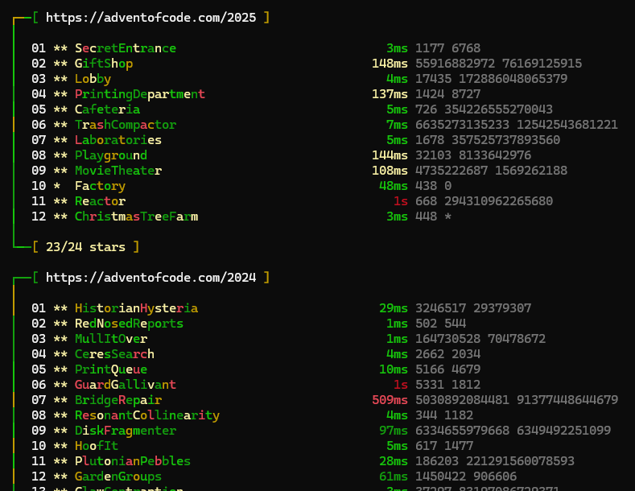

# AoC

Advent of Code playground and solver suite in C#/.NET, including:

- console runner for puzzle solutions
- minimal API for puzzle metadata and execution
- browser UI for progress overview
- SDL visualizations for selected puzzles
- generator for new day templates and input download



## Projects

- `AoC.App` - main console app that discovers and runs puzzle classes.
- `AoC.Common` - shared puzzle abstractions, discovery, input handling, logging, and HTTP helper.
- `AoC.Api` - ASP.NET Core minimal API exposing puzzle metadata and run endpoints.
- `AoC.Ui` - static HTML/JS UI consuming `AoC.Api`.
- `AoC.Vis.App` - SDL-based visualizations for selected puzzle solutions.
- `AoC.Gen` - scaffolding utility for input download and puzzle code generation.

## Tech Stack

- .NET 8
- ASP.NET Core Minimal API
- SDL2 (`SDL2-CS.NetCore`) for visualization

## Prerequisites

1. .NET SDK 8.0+
2. Windows (recommended for current local paths and scripts)
3. Native SDL2 DLLs (already included under `3rd/SDL2` and copied post-build for `AoC.Vis.App`)
4. Local external assemblies expected by this repo:
	- `..\\..\\Ujeby\\publish\\Ujeby.Core.dll`
	- `..\\..\\Ujeby\\publish\\Ujeby.dll` (for `AoC.Vis.App`)

If these DLLs are missing, build/reference setup in the dependent Ujeby repository is required first.

## Solution Layout

```text
AoC.sln
AoC.App/        # puzzle implementations (grouped by year)
AoC.Common/     # shared runtime
AoC.Api/        # HTTP API + launch profile for UI
AoC.Ui/         # static web dashboard
AoC.Vis.App/    # SDL visual app
AoC.Gen/        # code/input generator
3rd/SDL2/       # native SDL2 binaries
screen.png      # screenshot used in this README
```

## Build

From repository root:

```powershell
dotnet restore AoC.sln
dotnet build AoC.sln -c Debug
```

## Run

### 1) Console solver (`AoC.App`)

```powershell
dotnet run --project AoC.App
```

The app loads `appsettings.json` and then a preset-specific file based on `preset.txt`.

Example in this repo:

- `preset.txt` contains `all`
- therefore `AoC.App` also loads `appsettings.all.json`

Puzzle filter format is `year:day` with wildcards supported:

- `*:*` all puzzles
- `2024:*` full year
- `2024:?` only puzzles with missing expected answers
- `2018` year shorthand

Input files are resolved as:

```text
<InputRoot>/<year>/<day>_input<suffix>.txt
```

Example: `AoC.Input/2024/05_input.sample.txt`

### 2) API + Browser UI (`AoC.Api` + `AoC.Ui`)

```powershell
dotnet run --project AoC.Api
```

Default launch profile:

- API: `http://localhost:5500`
- UI: opens `AoC.Ui/index.html` in browser

UI fetches:

- `GET /meta` for puzzle metadata by year
- `GET /{year}/{day}` to execute and return result/timing for a puzzle

### 3) Visualization app (`AoC.Vis.App`)

```powershell
dotnet run --project AoC.Vis.App
```

Runs SDL window with selectable visualizations for implemented puzzles.

### 4) Generator (`AoC.Gen`)

```powershell
dotnet run --project AoC.Gen
```

Capabilities:

- download missing inputs
- generate missing daily puzzle class templates

`AoC.Gen/appsettings.json` controls:

- `AoC:Code` path to `AoC.App`
- `AoC:Input` path to input storage
- `AoC:Session` path to Advent of Code session cookie file

## Configuration Files

`AoC.App` includes multiple preset files:

- `appsettings.all.json`
- `appsettings.next.json`
- `appsettings.unsolved.json`
- `appsettings.unsolveds.json`
- `appsettings.2018.json`
- `appsettings.2024.json`

Switch preset by editing `preset.txt` in repo root.

## Input Data

Expected external input storage is configured under `AoC:Input` (for example `AoC.App/appsettings.json`).

If no `AoC:Input` is set, app falls back to current working directory.

## Utilities

- `clear-log.cmd` removes local `AoC.Output.*.txt` files.

## Notes

- Puzzle classes are discovered by reflection from assemblies whose names start with `Ujeby.AoC.` and contain `AoCPuzzle` attribute.
- API forces broad CORS headers for local UI interoperability.
- Some default config paths are machine-specific and should be adjusted per environment.
